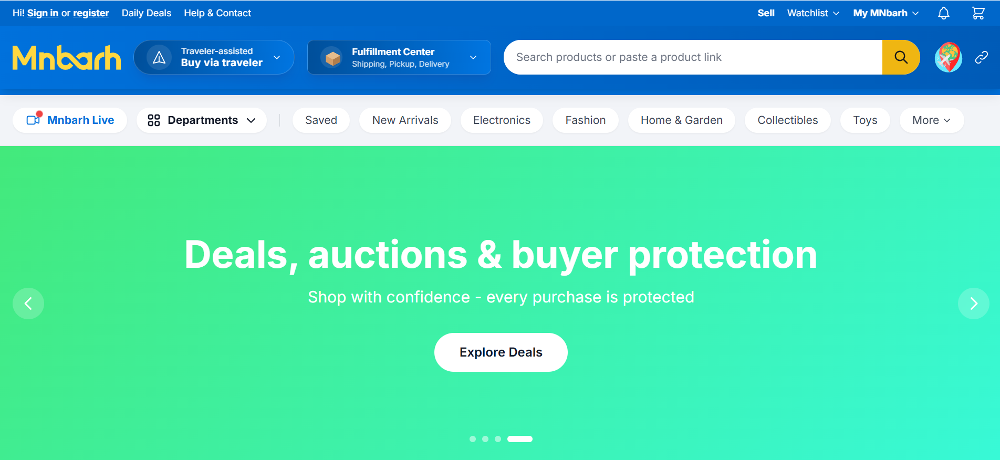
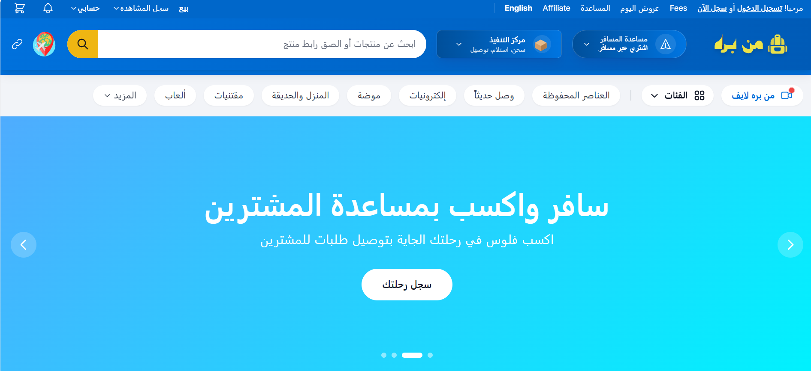
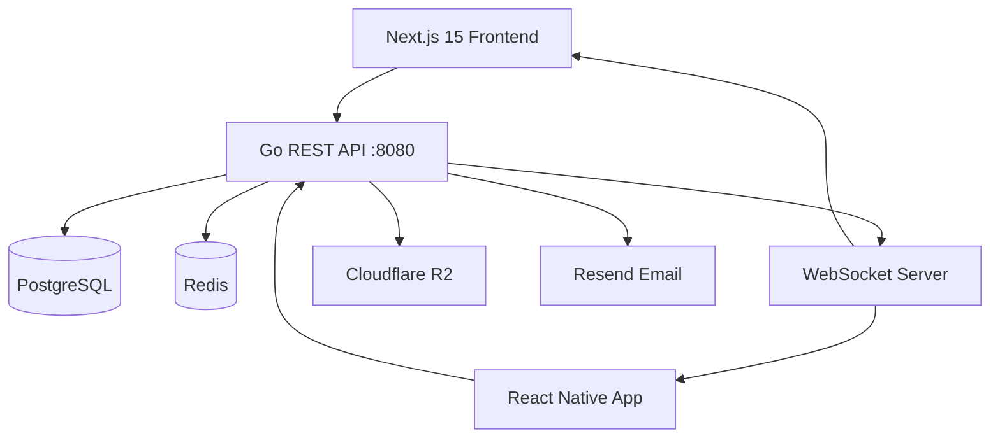

<p align="center">
  
</p>

<h1 align="center">GeoCore Next</h1>

<p align="center">
  <strong>A modern, high-performance classifieds & auctions platform built to replace legacy PHP solutions like Geodesic Solutions</strong>
</p>

<p align="center">
  <a href="https://go.dev"></a>
  <a href="https://nextjs.org"></a>
  <a href="./LICENSE"></a>
  <a href="https://github.com/hossam-create/geocore-next/stargazers"></a>
  <a href="https://github.com/hossam-create/geocore-next/commits/main"></a>
</p>

<br />

## Screenshots

<table>
  <tr>
    <td align="center">
      <br />
      <em>Homepage & Browse</em>
    </td>
    <td align="center">
      <br />
      <em>Listing Detail</em>
    </td>
  </tr>
  <tr>
    <td align="center">
      <br />
      <em>Live Auction</em>
    </td>
    <td align="center">
      <br />
      <em>Real-time Chat</em>
    </td>
  </tr>
</table>

<br />

## Features

- 🏷️ **Classifieds listings** with custom fields per category
- 🔨 **Real-time auction engine** (English, Dutch, Reverse)
- 💬 **WebSocket-powered real-time chat**
- 🌍 **Multi-currency & multi-language support** (Frankfurter API + ip-api.com)
- 📍 **Location-based search** (Nominatim OpenStreetMap)
- 📱 **React Native mobile app** (iOS & Android)
- 🛡️ **JWT authentication** with refresh tokens
- 🔍 **Full-text search** with PostgreSQL
- 💳 **Integrated payment gateway** (Stripe + PayMob)
- 🏪 **Seller storefronts** with custom URLs
- 📊 **Admin dashboard** with moderation tools

<br />

## Tech Stack

| Layer | Technology | Purpose |
|-------|------------|---------|
| **Backend** | Go 1.22, Gin, GORM | REST API, WebSocket server |
| **Frontend** | Next.js 15, React 19, Tailwind CSS | Web application |
| **Database** | PostgreSQL 16, Redis 7 | Primary storage, caching |
| **Mobile** | React Native, Expo | iOS & Android apps |
| **Infrastructure** | Docker, GitHub Actions, Nginx | Containerization, CI/CD |

<br />

## Architecture



<br />

## Quick Start

### Prerequisites

- Go 1.22+
- Node.js 18+
- PostgreSQL 16
- Redis
- Docker (optional)

### Installation

```bash
# Clone the repository
git clone https://github.com/hossam-create/geocore-next.git
cd geocore-next

# Backend setup
cd backend
cp .env.example .env
# Edit .env with your config
go mod download
go run ./cmd/api/main.go

# Frontend setup (new terminal)
cd frontend
cp .env.local.example .env.local
pnpm install
pnpm dev
```

### Using Docker

```bash
docker-compose up -d
```

| Service | URL |
|---------|-----|
| **Frontend** | http://localhost:3000 |
| **API** | http://localhost:8080 |
| **Adminer** | http://localhost:8081 |

<br />

## Environment Variables

> See `.env.example` in both `/backend` and `/frontend` directories.

### Backend

| Variable | Description |
|----------|-------------|
| `DATABASE_URL` | PostgreSQL connection string |
| `REDIS_URL` | Redis connection string |
| `JWT_SECRET` | JWT signing secret (min 32 chars) |
| `JWT_REFRESH_SECRET` | Refresh token secret |
| `S3_BUCKET` | Cloudflare R2 bucket name |
| `S3_ENDPOINT` | R2 endpoint URL |
| `STRIPE_SECRET_KEY` | Stripe API key |
| `RESEND_API_KEY` | Resend email API key |
| `PORT` | Server port (default: 8080) |

### Frontend

| Variable | Description |
|----------|-------------|
| `NEXT_PUBLIC_API_URL` | Backend API URL |
| `NEXT_PUBLIC_WS_URL` | WebSocket URL |
| `NEXT_PUBLIC_STRIPE_PUBLIC_KEY` | Stripe publishable key |

<br />

## Project Structure

```
geocore-next/
├── backend/           # Go REST API
│   ├── cmd/           # Entry points
│   ├── internal/
│   │   ├── auctions/  # Auction engine
│   │   ├── chat/      # WebSocket chat
│   │   ├── listings/  # Listings CRUD
│   │   ├── auth/      # Authentication
│   │   └── ...
│   ├── migrations/    # DB migrations
│   └── pkg/           # Shared utilities
├── frontend/          # Next.js 15 app
│   ├── artifacts/
│   │   └── web/       # Web application
│   ├── components/    # Reusable UI
│   └── lib/           # API client, utils
├── mobile/            # React Native (Expo)
├── docs/              # Documentation & screenshots
│   └── screenshots/
└── docker-compose.yml
```

<br />

## API Documentation

Full API docs available at `/api/docs` (Swagger UI) when running locally.

| Method | Endpoint | Description |
|--------|----------|-------------|
| `POST` | `/api/v1/auth/register` | Register new user |
| `POST` | `/api/v1/auth/login` | Login & get JWT |
| `GET` | `/api/v1/listings` | Browse listings |
| `POST` | `/api/v1/listings` | Create listing |
| `GET` | `/api/v1/auctions/:id` | Auction details |
| `WS` | `/ws/auctions/:id` | Live auction feed |
| `WS` | `/ws/chat/:id` | Real-time chat |

<br />

## Roadmap

- [x] Core listing & browsing
- [x] English auction with real-time bidding
- [x] WebSocket chat
- [x] Public API integrations (Frankfurter, ip-api, Nominatim)
- [x] Dutch & Reverse auctions
- [x] Seller storefronts
- [x] Wallet & payment gateway
- [ ] React Native mobile app (in progress)
- [x] Admin dashboard
- [ ] Live streaming auctions

<br />

## Contributing

Contributions are welcome! Please read [CONTRIBUTING.md](./CONTRIBUTING.md) first.

<br />

## License

MIT License — see [LICENSE](./LICENSE) for details